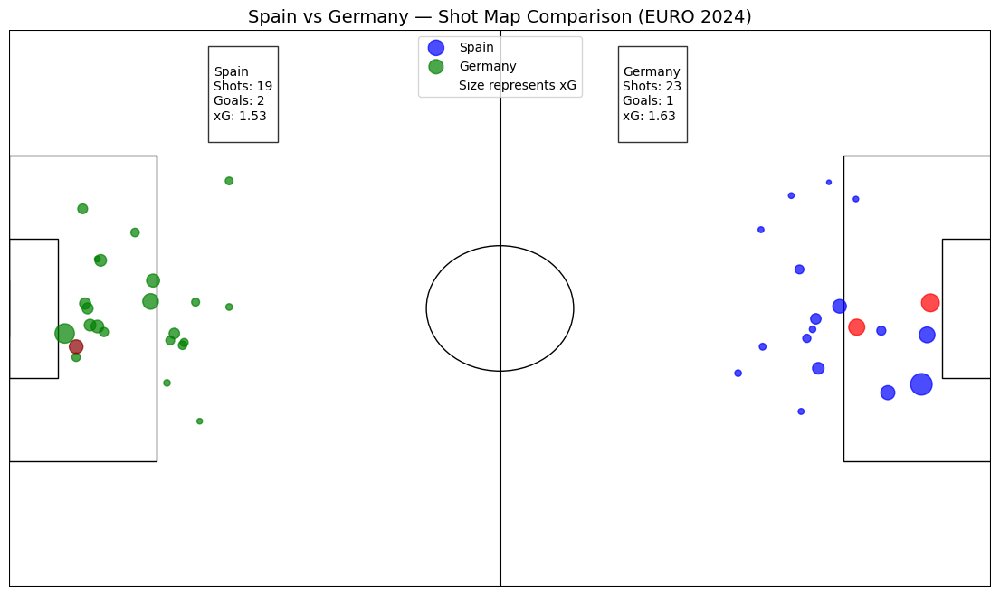
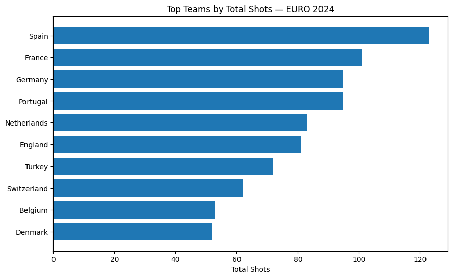
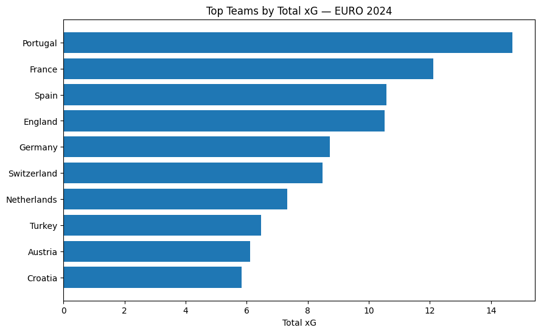
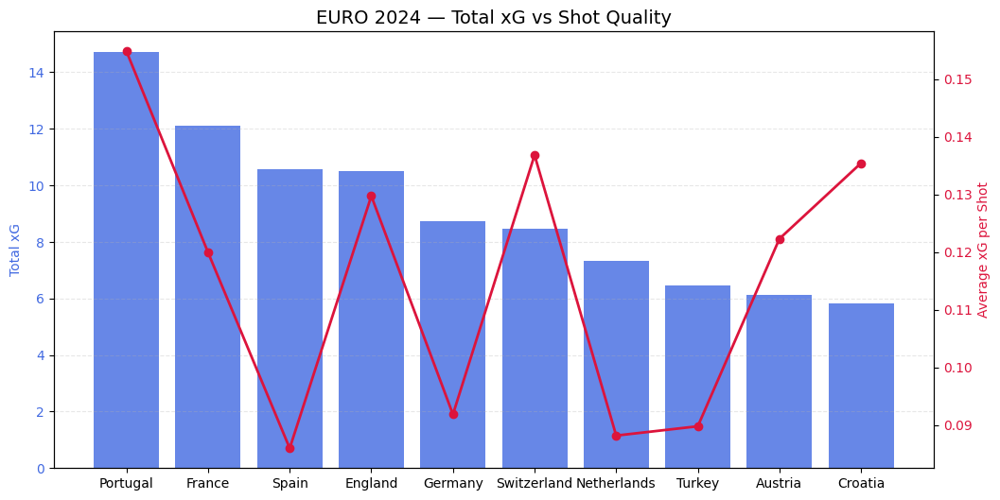

# ⚽ EURO 2024 Shot Analysis — From Match-Level Insights to Tournament Trends

## 📌 Project Overview

This project explores attacking performance during **UEFA EURO 2024** using StatsBomb Open Data.
The analysis moves from **single-match spatial analysis** (Spain vs Germany — Quarterfinal) toward **tournament-level attacking trends**, combining data science techniques with football analytics methodology.

Rather than only measuring goals, this project evaluates:

* Shot volume
* Expected goals (xG)
* Shot quality (average xG)
* Attacking efficiency vs volume trade-off

The objective is to demonstrate how event data can be translated into interpretable tactical insights using reproducible data science workflows.

---

## 🎯 Objectives

* Analyze shot locations and expected goals (xG)
* Build spatial visualizations used in football analytics
* Compare attacking structure between teams
* Identify tournament-wide attacking profiles
* Translate quantitative analysis into football insights

---

## 📊 Dataset

* Source: **StatsBomb Open Data**
* Competition: UEFA EURO 2024
* Data Type: Event-level match data

### Key Variables Used

* Shot location (x, y coordinates)
* Expected Goals (xG)
* Shot outcome
* Team metadata

Data is accessed directly via `statsbombpy`, so no manual download is required.

---

## 🧰 Tools & Technologies

* Python
* Pandas
* NumPy
* Matplotlib
* StatsBombPy
* Google Colab / Jupyter Notebook

---

## 📂 Project Structure

```
euro2024-shot-analysis/
│
├── insight_images/
│   ├── shot_map_qf.png
│   ├── top_total_shots.png
│   ├── top_total_xG.png
│   ├── top_avg_xG.png
│   └── total_vs_avg_xG.png
│
├── notebooks/
├── main.py
├── requirements.txt
└── README.md
```

---

# 🔵 Match-Level Analysis — Shot Map (Spain vs Germany)

## Methodology

* Extract shot events from match data
* Engineer spatial features:

  * x, y coordinates
  * goal indicator
* Mirror coordinates for opposing team
* Plot both teams on a single pitch

## Key Insight



Although Germany attempted **more total shots**, Spain created more dangerous attempts inside the penalty area.

* Spain: 2 goals from 1.53 xG
* Germany: 1 goal from 1.63 xG

Spain generated fewer attempts but with higher-quality shot locations, suggesting a more efficient attacking structure.

---

# 🟣 Tournament-Level Attacking Trends

The analysis expands from single-match insight into competition-wide patterns by aggregating team statistics.

## Metrics Used

* Total Shots → attacking volume
* Total xG → attacking output
* Average xG → shot quality

---

## 📊 Shot Volume Analysis



Spain recorded the highest shot volume (123), followed by France (101) and Germany & Portugal (95).

High shot volume does not necessarily imply elite chance creation — teams can generate many low-probability attempts.

---

## 📊 Total xG Analysis



Portugal led the tournament in total xG, showing a strong attacking output supported by both volume and quality.

France also generated high xG relative to their shot volume, indicating efficient chance creation.

---

## 📊 Average xG (Shot Quality)


Average xG highlights teams that prioritize high-value opportunities:

* Portugal and Switzerland ranked among the highest
* Spain ranked lower despite leading total shots

This suggests contrasting attacking philosophies between sustained pressure and selective chance creation.

---

## 📊 Total vs Average xG Relationship



Key attacking profiles observed:

### Spain — High Volume, Lower Efficiency

* Highest total shots
* Moderate total xG
* Lower average xG

Spain relied on sustained attacking pressure rather than elite shot selection.

---

### France vs Germany — Similar Volume, Different Quality

France generated significantly more total xG than Germany despite similar shot volume, suggesting better chance construction.

---

### Portugal — High Volume, High Efficiency (Outlier)

Portugal combined:

* Top total xG
* Elite average xG
* High shot volume

This makes them the most balanced attacking team in the tournament.

---

### Switzerland — Low Volume, High Efficiency

Switzerland produced fewer shots but maintained one of the highest average xG values, highlighting a selective attacking approach.

---

### Netherlands & Turkey — Volume without Elite Output

Both teams generated many attempts but lower average xG, indicating less optimal shot selection.

---

# 📈 Analytical Framework

This project follows a layered sports analytics workflow:

```
Match Analysis
      ↓
Comparative Analysis
      ↓
Tournament Trend Analysis
```

This mirrors real-world analyst pipelines where micro-level spatial analysis scales into macro-level performance evaluation.

---

## 🧠 Key Takeaways

* Attacking strength is not defined solely by total xG.
* Shot quality (average xG) reveals tactical decision-making.
* Spatial visualization improves interpretability of event data.
* Combining volume and efficiency metrics uncovers distinct attacking styles.

---

## ⚙️ Installation & Setup

### Clone Repository

```bash
git clone https://github.com/RiznoFadhil/euro2024-shot-analysis.git
cd euro2024-shot-analysis
```

### Create Virtual Environment (Recommended)

Windows:

```bash
python -m venv venv
venv\Scripts\activate
```

MacOS / Linux:

```bash
python -m venv venv
source venv/bin/activate
```

### Install Dependencies

```bash
pip install -r requirements.txt
```

### Run the Project

```bash
python main.py
```

Tested on **Python 3.10+**

---

## 🚀 Future Extensions

* Player-level shooting profiles
* Shot density heatmaps
* Attacking style clustering
* Cross-competition comparison

---

## 👤 Author

**Rizno Fadhil** | Statistics & Data Science Graduate — IPB University

Focus Areas:

* Data Science
* Sports Analytics
* Performance Analytics

Portfolio: [https://bit.ly/RiznoFadhil_DataPortfolio](https://bit.ly/RiznoFadhil_DataPortfolio) | LinkedIn: [http://www.linkedin.com/in/rizno-fadhil](http://www.linkedin.com/in/rizno-fadhil)
